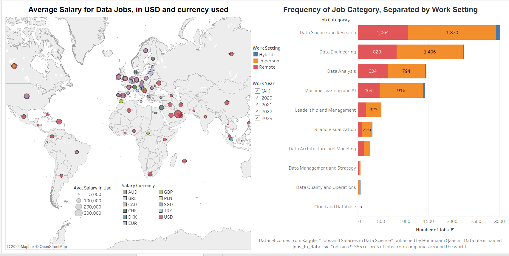

Python, Tableau, R, and SQL
### PROJECT 1: Python
### Convolutional Neural Network to Classify Rock, Paper, Scissors Images from Tensorflow Dataset
Github Repository Link: [Rock, Paper, Scissors Convolutional Neural Network](https://github.com/OliviaS72/RockPaperScissors_CNN)

**This project used the 'rock_paper_scissors' dataset from tensorflow_datasets. There are 2,520 images in the training dataset and 372 images in the testing dataset. All of these images show hand gestures of either rock, paper, or scissors. The layers for the Convolutional Neural Network are shown below:**

**The overall testing accuracy of this model was about 77%.**

**While the details of the composition of the neural network could be technically discussed (which is provided in detail within the wiki of the above GitHub link) one of the most important details to explore with this project is to consider how the classification could be further improved. Below are 25 misclassified images. The classification associated with "p: " is the predicted class for each image below it, while the classification associated with "e: " is the expected, or actual, class for each image below it. Class 0 is for rock, 1 is for paper, and 2 is for scissors.**

**More images were used for training than for testing, but within the 2,520 training images, an equal amount (840) of each class were present and within the 372 testing images, an equal amount (124) were present. The preview of 25 misclassified images is a part of a group of 86 total misclassifed images out of 372.**

**Out of the misclassified images, 25 were rock, 4 were paper, and 57 were scissors. The model seems to be doing the best at predicting paper, but struggles to distinguish between rock and scissors. The model could likely be improved if more pictures were included in training that clearly were different among the rock and scissors photos.**

### PROJECT 2: Python
### Recurrent Neural Network to Classify Text related to Science Fields of Chemistry, Biology, and Physics
Github Repository Link: [Science Comments Recurrent Neural Network](https://github.com/OliviaS72/RNNScienceText)

**This project uses a Kaggle dataset found here ([Kaggle Data for Science Comments](https://www.kaggle.com/datasets/vivmankar/physics-vs-chemistry-vs-biology/data)) to develop a recurrent neural network for text classification.**

**This dataset contains 10,281 comments relating to the fields of physics, chemistry, biology. The training dataset consists of 8,695 comments, and the testing data consists of 1,586 comments. The data is cleaned so that extra white space is replaced by blanks, urls, emojis, symbols, and pictographs are removed. Also, common stop words are removed and words are reduced to their roots, or stems. A tokenizer with GloVe Embedding is used to convert the text to numerical arrays that the neural network can actually use for training.**

**To alleviate the issue of short term memory with RNNs, which is when the information from words early on in the text does not have much impact by the time the network stops back propogation. In this project, I used a bidrectional LSTM (Long Short-Term Memory) layer which uses gates to have longer-term memory of past information.**

**The final accuracy of this model was 0.81. A plot of accuracy, loss, precision, and recall for the training and validation set is shown below:**   

**As can be seen in the above plots, overfitting does not seem to be an issue with this neural network because the training loss steadily decreases, and the validation loss never increases to a large degree. Also, the training accuracy steadily increases, and the validation accuracy never decreases to a large degree.**

**Some advantages to this implementation are that pre-trained embedding allowed the model to learn words that may not have been observed during training, but would be realized in unseen, testing data. Additionally, the LSTM layer helped alleviate the issue of diminishing gradients and helped the model pick up word meanings and connotation in the forward and backward directions.**

### PROJECT(S) 3: Tableau
**I have published a few Tableau dashboards I created on Tableau Public. Here is a preview of one:  **

**Here is a link to my Tableau Public Page: [Olivia Schultheis' Tableau Public](https://public.tableau.com/app/profile/olivia.schultheis/vizzes)**

### PROJECT 4: R
**I completed a project investigating what characteristics or factors about counties in the U.S. make them more or less likely to be medically underserved. The data comes from the [Social Determinants of Health Database (SDOH)](https://www.ahrq.gov/sdoh/data-analytics/sdoh-data.html), released by the Agency for Human Research and Quality (AHRQ). Each U.S. state's Primary Care Office (PCO) applies for MUA (Medically Underserved Area) status, and the Health Resources & Service Administration decides if the state's application meets the criteria for a Medically Underserved Area. My research paper details my procedure and findings to develop a logistic regression model with a reasonable amount of variables for a data set including U.S. counties with over 900 variables. [Here is the link to my GitHub repository for this project](https://github.com/OliviaS72/LogRegCountiesMedicalService). If you are interested in reading my research paper for this project, you can download it [here](https://github.com/OliviaS72/LogRegCountiesMedicalService/blob/main/LogRegMUACounties_GITHUB_Upload.docx) by clicking on "View raw".**

### PROJECT(S) 5: R
**On RPubs, I have posted multiple visualizations I created, including some using the trelliscope, ggplot2, and plotly packages. Multiple of these plots are animated or interactive in some way, so feel free to explore the trends these plots travel through. Below is a preview of a scatterplot I created in one of my RPubs Projects:  **

**Feel free to check out my interactive plots and more at: [Olivia Schultheis' RPubs Page](https://rpubs.com/Olivias3)**

### PROJECT 6: SQL Veterinary Database: 
**I created an 8 table database from scratch to model a veterinary clinic. I have a GitHub Repository with a document attached showing all my code creating the tables and entering in records below:**  

Github Repository Link: [SQL Veterinary Database Creation](https://github.com/OliviaS72/SQLVetDatabase)

**To view the database creation, you would need to visit the repository above, go to 'Vet Database Creation.docx' below the README.md file for this repository, and select the link to 'View raw' to download the original document.**

**Below is a preview of code for some table creation and data input into the tables:**  

### This code creates the PETOWNER and PATIENT tables, which are just 2 of the 8 total tables in the database   
  
### This code enters records into the PETOWNER and PATIENT tables  
  

### PROJECT 7: Web Scraping in Python to Visualize Temperature Data
**I used web scraping to extract tables related to temperature data using read_html in Python. The data comes from two Wikepedia pages. One is for the country of Prague, Czech Republic and the other is for Santiago, Chile. The webpages are:  **
[Prague Wikipedia Page](https://en.wikipedia.org/wiki/Prague)  
[Santiago Wikipedia Page](https://en.wikipedia.org/wiki/Santiago)   

**The data that I focused on for plotting was the daily mean temperature in degrees Celcius for each country. Since Prague is in the northern hemisphere and Santiago is in the southern hemisphere, the graph shows two lines that are "U-shaped" opposite of each other. Prague experiences summer mid-year, while Santiago experiences winter mid-year. The temperature data was in a format where with #C (#F), with the Celcius temperature listed first and the Fahrenheit temperature listed after in parentheses with a space in between. I had to split up the Celcius and Fahrenheit temperatures for each country, remove the ending parentheses, and convert all the values to floats. There were also an extraneous row for the column name and for a yearly daily average temperature, so I removed these rows.**

**The final plot is seen below:**  

